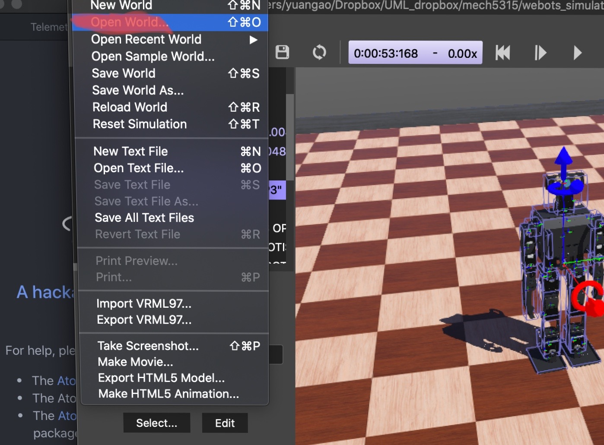

# MECH5315-Webots-simulation
---
## software download and install
1. go to the Webots official website: https://cyberbotics.com or click [here](https://cyberbotics.com).
2. download the installation package that suit your operating system. *Ubuntu user please follow the installation instruction on the website*
3. Webots supports C/C++, Java, Python, Matlab. However, you **MUST** install these programming languages first to use them in Webots. The detailed languages setup instruction can be found [here](https://cyberbotics.com/doc/guide/language-setup).  

## instruction on how to run this homework
>in this homework, there are two files you need to load into the webots, `empty_world.world` file and the controller file `mech5315_controller.m`. (in this homework, we use MATLAB).
It is highly recommended to go through the official tutorial first, although it is not required. The official tutorial can be found [here](https://cyberbotics.com/doc/guide/tutorials)

### Folder explain
1. `controllers` : this folder contains the main control script, other helper functions, and necessary data. **You work is in this folder.**
2. `figs`: this folder contains the figs for this README.md instruction. Your work should **NOT** be in this folder.
3. `world`: this folder contains the `empty_world.world`, Your work should **NOT** be in this folder.

### Steps to run the simulation for this homework
1. Load the  `empty_world.world` file.

2. Load the `mech5315_controller.m` file. (It is highly possible that the the controller file is already loaded, this step might be unnecessary.)

3. Click the play button to start the simulation.
4. The `K_p` and `K_d` gain settings of each motor are located in the file `get_motor.m`, you are supposed to adjust values there.
